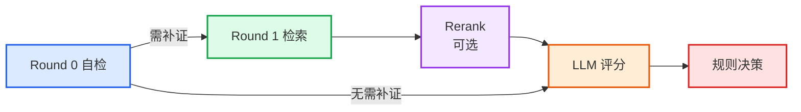

<div align="center">

# Quality-Agent

[](https://www.python.org/downloads/)
[](./LICENSE)

</div>

医学 QA 数据质量评估工具。

通过 `LLM 自检 -> 按需检索 -> LLM 评分 -> 规则决策` 的流水线，对每条 QA 输出保留/丢弃结论、评分结果和证据摘要。

---

## 目录

- [项目定位](#项目定位)
- [核心特性](#核心特性)
- [核心流程](#核心流程)
- [评估维度](#评估维度)
- [快速开始](#快速开始)
  - [1. 环境要求](#1-环境要求)
  - [2. 安装依赖](#2-安装依赖)
  - [3. 配置 LLM](#3-配置-llm)
  - [4. 准备输入数据](#4-准备输入数据)
  - [5. 运行评估](#5-运行评估)
- [输出结果](#输出结果)
- [配置说明](#配置说明)
  - [CLI 参数](#cli-参数)
  - [YAML 配置文件](#yaml-配置文件)
- [开启外部检索](#开启外部检索)
- [开启内部检索](#开启内部检索)
- [开启 Rerank](#开启-rerank)
- [项目结构](#项目结构)
- [使用边界与免责声明](#使用边界与免责声明)
- [License](#license)

---

## 项目定位

Quality-Agent 不是生成式问答系统，而是一个**数据质检 Agent**，适合以下场景：

- 医学 QA 数据集清洗
- 标注结果的自动初筛
- 需要保留评分理由和证据链的批量评估任务

当前版本的设计重点：

- **按需检索**：先判断是否真的需要检索，尽量减少无效调用
- **多源补证**：需要补证时，同时支持内部知识库和外部来源
- **规则兜底**：最终结论由代码按阈值决定，而不是直接交给模型拍板

---

## 核心特性

| 特性 | 说明 |
|------|------|
| **多格式输入** | 支持 `JSON` / `JSONL` / `CSV` |
| **字段兼容** | 兼容 `question` / `Question` / `q`、`answer` / `Answer` / `a`，以及 OpenAI 风格的 `messages` 格式 |
| **自动 ID** | 若未提供 `id`，自动按索引生成 `qa_0`、`qa_1` 等 |
| **多后端 LLM** | 支持 `anthropic`、`openai`、`vllm` |
| **内部检索** | `BM25 + TF-IDF + RRF + 邻域扩展` |
| **外部检索** | 支持 `exa_mcp`、`pubmed`、`bing_search`、`baidu_search` |
| **可选重排** | 本地 CrossEncoder 或 API Reranker（Jina / Cohere） |
| **完整输出** | 保留数据、剔除数据、评估报告、文本摘要、日志、检查点 |

---

## 核心流程



1. **Round 0 自检**：LLM 先判断现有信息是否已经足够完成质量评审
2. **Round 1 检索**：若存在关键缺口，并行执行内部检索和外部检索
3. **Rerank（可选）**：若启用 `config/rerank.yaml`，对内部/外部候选统一重排
4. **LLM 评分**：从完整性、准确性、专业性三个维度打分
5. **规则决策**：默认要求 `总分 >= 70` 且 `准确性 >= 35`；若证据仍不足，则标记为**待人工复核**

---

## 评估维度

| 维度 | 分值 | 考察要点 |
|------|------|----------|
| **完整性** | 35 分 | 回答是否覆盖了问题涉及的关键信息点，无重大遗漏 |
| **准确性** | 35 分 | 事实是否正确，与权威医学知识是否一致 |
| **专业性** | 30 分 | 表述是否符合医学规范，术语使用是否恰当 |
| **总分** | 100 分 | 三项之和 |

> 默认规则：`总分 >= 70` **且** `准确性 >= 35` 方可保留。任一条件不满足即丢弃或待复核。

---

## 快速开始

### 1. 环境要求

- Python >= 3.9
- （可选）若使用本地 Reranker，建议预留 2GB+ 磁盘空间用于模型自动下载

### 2. 安装依赖

```bash
pip install -r requirements.txt
```

> `requirements.txt` 中已包含核心依赖。若使用 **Cohere API Reranker**，请额外安装：`pip install cohere>=5.0.0`

### 3. 配置 LLM

**本地 vLLM（推荐）：**

如果使用本地部署的 `vLLM` 或其他 OpenAI 兼容接口，通过 `--llm-base-url` 指定地址即可：

运行示例：

```bash
python -m src.main data/input/example_qa.json \
  --llm-provider vllm \
  --llm-model Qwen/Qwen2.5-7B-Instruct \
  --llm-base-url http://localhost:8000/v1
```

**Anthropic：**

```bash
export ANTHROPIC_API_KEY="sk-ant-..."
```

**OpenAI：**

```bash
export OPENAI_API_KEY="sk-..."
```

### 4. 准备输入数据

标准 QA 格式示例：

```json
[
  {
    "question": "2型糖尿病患者可以服用二甲双胍吗？",
    "answer": "可以。二甲双胍是2型糖尿病的一线治疗药物..."
  }
]
```

同时支持 OpenAI 风格的 `messages` 格式：

```json
[
  {
    "messages": [
      {"role": "user", "content": "2型糖尿病患者可以服用二甲双胍吗？"},
      {"role": "assistant", "content": "可以。二甲双胍是2型糖尿病的一线治疗药物..."}
    ]
  }
]
```

仓库内置示例文件：[data/input/example_qa.json](data/input/example_qa.json)。

### 5. 运行评估

**最简运行：**

```bash
python -m src.main data/input/example_qa.json
```

**指定输出目录：**

```bash
python -m src.main data/input/example_qa.json -o data/output
```

**使用 OpenAI：**

```bash
python -m src.main data/input/example_qa.json \
  --llm-provider openai \
  --llm-model gpt-4o
```

**使用本地 vLLM：**

```bash
python -m src.main data/input/example_qa.json \
  --llm-provider vllm \
  --llm-model Qwen/Qwen2.5-7B-Instruct \
  --llm-base-url http://localhost:8000/v1
```

**使用启动脚本（`Start.sh` 示例）：**

```bash
bash Start.sh
```

**调整阈值：**

```bash
python -m src.main data/input/example_qa.json \
  --total-threshold 75 \
  --accuracy-threshold 40
```

完整参数可通过以下命令查看：

```bash
python -m src.main --help
```

---

## 输出结果

默认输出目录为 `data/output/`。典型结构如下：

```text
data/output/
├── cleaned_data/
│   └── retained_qa.jsonl
├── rejected/
│   └── discarded_qa.jsonl
├── reports/
│   ├── evaluation_report.json
│   └── summary.txt
├── summary.json
├── medical_qa_agent.log
└── checkpoint/
    └── checkpoint.json
```

说明：

- `cleaned_data/` 和 `rejected/` 仅在存在对应结果时生成
- `reports/evaluation_report.json` 为完整结构化报告
- `reports/summary.txt` 为面向阅读的摘要
- `checkpoint/` 会在达到 `--checkpoint-interval` 时写入，支持断点续跑

---

## 配置说明

### CLI 参数

| 参数 | 说明 | 默认值 |
|------|------|--------|
| `--llm-provider` | `anthropic` / `openai` / `vllm` | `anthropic` |
| `--llm-model` | 模型名称 | `claude-3-5-sonnet-20241022` |
| `--llm-base-url` | OpenAI 兼容接口地址 | 空 |
| `--llm-api-key` | API Key，未传时读环境变量 | 空 |
| `--llm-temperature` | 生成温度 | `0.1` |
| `--llm-max-tokens` | 最大生成 token 数 | `1500` |
| `--total-threshold` | 总分阈值 | `70` |
| `--accuracy-threshold` | 准确性阈值 | `35` |
| `--checkpoint-interval` | 检查点间隔 | `100` |
| `-o`, `--output` | 输出目录 | `data/output` |

### YAML 配置文件

| 文件 | 用途 |
|------|------|
| `config/self_check.yaml` | 自检开关、置信度阈值、Prompt 路径 |
| `config/internal_search.yaml` | 内部检索开关、索引目录、召回和邻域参数 |
| `config/external_tools.yaml` | 外部检索总开关、工具列表、查询模板、超时等 |
| `config/rerank.yaml` | Reranker 开关、后端类型、模型和 `top_n` |

---

## 开启外部检索

当前外部检索由 `config/external_tools.yaml` 控制。仓库内已实现以下工具：

- `exa_mcp`
- `pubmed`
- `bing_search`
- `baidu_search`

示例：

```yaml
enabled: true
max_results_per_tool: 5
timeout: 10

tools:
  - name: exa_mcp
    enabled: true
    query_template: "{missing_slot}"
    endpoint: "exa"

  - name: pubmed
    enabled: true
    query_template: "{missing_slot}"
```

`exa_mcp` 依赖本机安装 `mcporter` 并配置好别名：

```bash
npm install -g mcporter
mcporter config add exa https://mcp.exa.ai/mcp
```

如果外部检索已启用但对应工具不可用，系统会跳过该工具；若自检判断必须检索、但最终仍未找到有效证据，则该条数据会被标记为 `证据不足，待人工复核`。

---

## 开启内部检索

内部检索依赖 `data/index/chunks.jsonl`。每行一个片段，格式如下：

```jsonl
{"chunk_id":"chunk_001","doc_id":"guideline_a","content":"...","chunk_index":0,"metadata":{"source":"NCCN"}}
{"chunk_id":"chunk_002","doc_id":"guideline_a","content":"...","chunk_index":1,"metadata":{"source":"NCCN"}}
```

然后在 `config/internal_search.yaml` 中启用：

```yaml
enabled: true
index_dir: data/index
bm25_top_k: 10
vector_top_k: 10
rerank_top_n: 3
neighborhood_window: 1
```

---

## 开启 Rerank

`config/rerank.yaml` 控制统一重排。示例：

```yaml
enabled: true
backend: local

local:
  model_name: BAAI/bge-reranker-base
  device: cpu
  batch_size: 32

top_n: 5
```

说明：

- `backend: local` 使用本地模型，首次运行可能自动下载权重
- `backend: api` 支持 `jina` 或 `cohere`
- API 模式可通过环境变量 `RERANK_API_KEY` 覆盖配置文件中的密钥

---

## 项目结构

```text
Quality-Agent/
├── config/                   # YAML 配置文件
│   ├── self_check.yaml
│   ├── internal_search.yaml
│   ├── external_tools.yaml
│   └── rerank.yaml
├── data/                     # 输入数据、索引、输出结果
│   ├── input/
│   ├── index/
│   └── output/
├── docs/                     # 设计文档与说明
├── src/
│   ├── evidence/             # 证据收集
│   │   ├── collector.py
│   │   ├── self_checker.py
│   │   ├── internal_search.py
│   │   └── reranker.py
│   ├── tools/                # 外部工具与辅助验证
│   │   ├── base.py
│   │   ├── external_search.py
│   │   ├── entity_extractor.py
│   │   ├── terminology_validator.py
│   │   ├── wikipedia_verifier.py
│   │   └── guideline_checker.py
│   ├── scoring/              # LLM 评分引擎
│   │   └── llm_engine.py
│   ├── decision/             # 规则决策引擎
│   │   └── engine.py
│   ├── processor/            # 批量处理
│   │   └── batch_processor.py
│   ├── report/               # 报告生成
│   ├── utils/                # 通用工具
│   │   ├── enum_utils.py
│   │   ├── file_utils.py
│   │   └── json_utils.py
│   ├── config.py             # 配置加载
│   ├── main.py               # 主入口
│   └── models.py             # 数据模型
├── Start.sh                  # 启动脚本示例
├── requirements.txt
└── README.md
```

---

## 使用边界与免责声明

- 这是一个**数据质量筛选工具**，不是医疗诊断或临床决策系统
- 内部检索只有在 `chunks.jsonl` 已准备且 `enabled: true` 时才会生效
- 外部检索依赖网络与外部工具可用性，结果稳定性受外部环境影响
- `docs/` 下部分文档是历史设计稿，实际行为应以 `src/` 当前实现为准
- 评估结果仅供参考，最终医学内容的质量判定建议由专业人员复核

---

## License

[MIT](./LICENSE)
